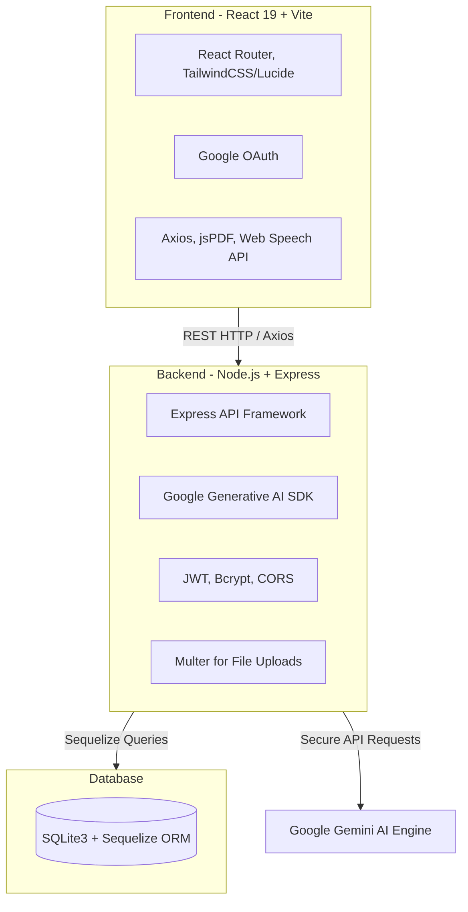
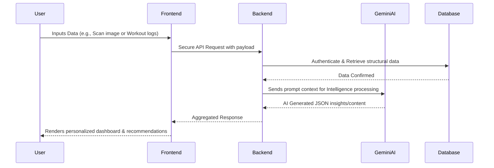

# NutriBharat AI 🥗🤖

NutriBharat AI is a comprehensive full-stack health and fitness application leveraging the power of Artificial Intelligence to provide personalized nutrition, workout tracking, community engagement, and smart health insights.

## 🌟 Features
- **AI-Powered Insights**: Integrates Google Generative AI (Gemini) for intelligent health and diet recommendations based on user inputs.
- **Diet & Workout Tracking**: Seamlessly track your daily nutrition intake, structured diet plans, and workout routines.
- **Social Engagement**: Built-in social features to connect with the community, share fitness progress, and stay motivated.
- **Secure Authentication**: End-to-end security using JWT auth and Google OAuth login integration.
- **Admin Dashboard**: Dedicated management panel for model regulation, user management, and system monitoring.
- **Export & Reports**: One-click PDF generation for diet plans and scanning reports using jsPDF.
- **Voice Interactivity**: Integrated Speech Recognition for hands-free interactions and quick queries.

## 🛠️ Technology Stack



## ⚙️ Execution Flow



## 🚀 Getting Started

### Prerequisites
- [Node.js](https://nodejs.org/) (v18+ recommended)
- Git

### 1. Backend Setup
Navigate to the backend directory, install packages, and spin up the server:

```bash
cd backend
npm install
npm run dev
```
The server will run on `http://localhost:5000`. 
**Note:** Ensure you create a `.env` file in the `backend` folder containing your `GEMINI_API_KEY` and `JWT_SECRET`.

### 2. Frontend Setup
Navigate to the frontend directory, install dependencies, and start Vite:

```bash
cd frontend
npm install
npm run dev
```
The React frontend will be accessible at `http://localhost:5173`.

## 📁 Project Architecture

```text
NutriBharat AI/
├── backend/
│   ├── src/
│   │   ├── routes/         # Express API Routes (admin, auth, etc.)
│   │   ├── models/         # Sequelize DB schemas
│   │   └── server.js       # Main server entrypoint
│   ├── package.json
│   └── .env                # Environment Variables (Ignored in Git)
├── frontend/
│   ├── src/
│   │   ├── components/     # Reusable UI components (BentoCard, etc.)
│   │   ├── pages/          # Main Views (WorkoutPage, ScanResult, LoginPage)
│   │   ├── App.jsx         # App Routing
│   │   └── main.jsx        # React root injector
│   └── package.json
└── README.md
```

## 🤝 Contribution
Contributions, issues, and feature requests are welcome! Feel free to check the issues page.
